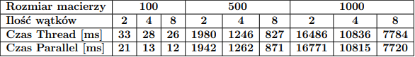
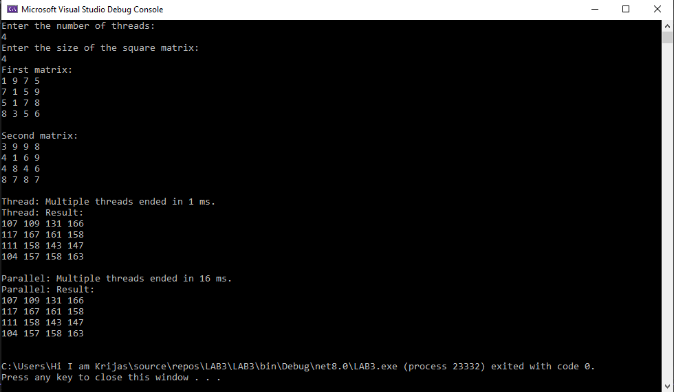
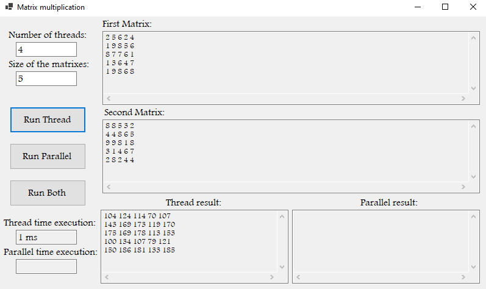
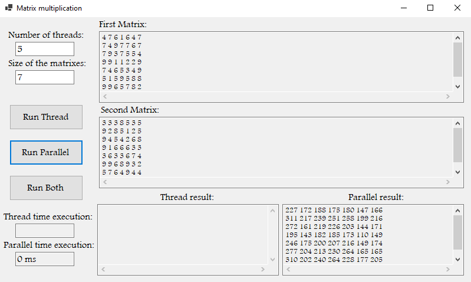
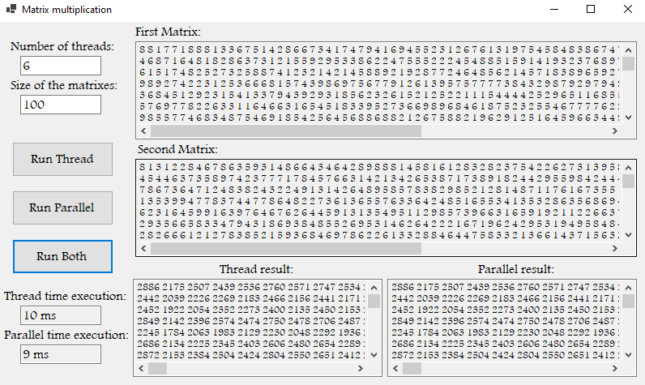
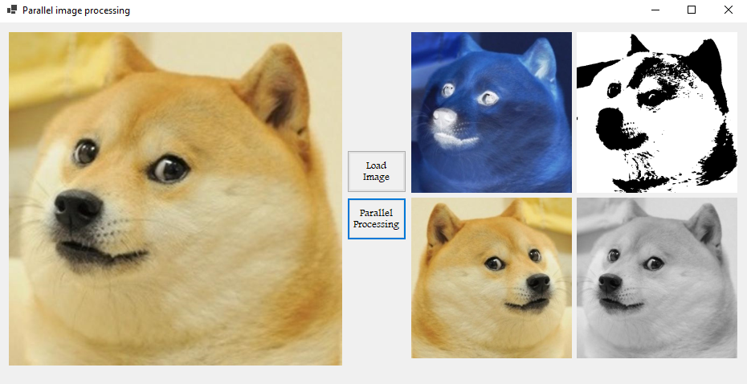
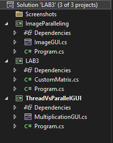

# MyApi

Autor: Krzysztof Maciejończyk

Opis programu:

Repozytorium zawiera kilka funkcjonalności. Jedną z nich jest możliwość przemnożenia macierzy kwadratowych, a drugą jest przetwarzanie obrazów. Programy wykorzystują wielowątkowość w celu przyspieszenia czasu obliczeń poszczególnych pól w macierzy lub pikseli w obrazie wynikowym. Wykorzystane zostały biblioteki Thread oraz Parallel, żeby przetestować różnice pomiędzy nimi.
Program został podzielony na 3 projekty:

**-LAB3** - konsolowa wersja przemnażania macierzy (zadanie 1 i 2).

**-ThreadVsParallelGUI** - aplikacja do przemnażania macierzy (zadanie 1 i 2).

**-ImageParalleling** - aplikacja do przetwarzania obrazów (zadanie 3).

LAB3 umożliwia użytkownikowi obliczanie wyniku mnożenia macierzy po odpowiednim wpisaniu liczby użytych w tym celu wątków oraz wielkości macierzy (NxN). Po prawidłowym uzupełnieniu, program wypisuje macierze wejściowe, czas potrzebny bibliotece Thread i Parallel do wykonania obliczeń oraz macierz wynikową. Utworzona została tutaj klasa **CustomMatrix.cs**, żeby konstruować macierze o podanym rozmiarze, uzupełniając ich pola cyframi psuedolosowymi od 1 do 9. W klasie tej też zamieszczono przeciążoną funkcję ToString(), żeby łatwiej wyświetlać macierze. Pozostałe projekty też korzystają z tej klasy, żeby przeprowadzać obliczenia.

ThreadVsParallelGUI zapewnia tę samą funkcjonalność, co poprzedni projekt, lecz tym razem w aplikacji Windows Forms. W odróżnieniu od poprzednika, program ten zezwala na kilka dodatkowych opcji. Użytkownik może wybrać, czy chce korzystać tylko z biblioteki Thread (przycisk Run Thread), tylko z biblioteki Parallel (przycisk Run Parallel), czy z obydwu bibliotek na raz (przycisk Run Both).

ImageParalleling różni się od dwóch projektów i służy do przeprowadzania czterech operacji na obrazie wejściowym. Są to negatyw, progowanie, lustrzane odbicie oraz przekształcenie do odcieni szarości. Na początku użytkownik za pomocą przycisku 'Load Image' wczytuje wybrany obraz z rozszerzeniem jpg do pamięci (w razie udanego wczytania obraz wyświetla się po lewej stronie ekranu), a przyciskiem 'Parallel Processing' rozpoczyna wielowątkowe przetwarzanie obrazów w technologii Parallel. Obrazy wynikowe pojawiają się następnie po prawej stronie ekranu.

Na koniec przeprowadzono analizę porównania czasów obliczeń za pomocą biblioteki Thread a Parallel. Poniżej zamieszczono tabelę z uśrednionymi czasami wykonywania się programu dla poszczególnych rozmiarów macierzy wejściowych oraz ilości użytych wątków:

W obydwu przypadkach czasy wykonywania zadania były bardzo zbliżone, zarejestrowano jedynie dwa razy szybsze działanie bliblioteki Thread dla rozmiaru macierzy równym 100.

W programach zastosowano wszelkie procedury uodporniające program na niepożądane działanie użytkownika, jak wpisanie złego formatu do pól tekstowych lub ich niewypyłnienia.

Poniżej umieszczono zrzuty ekranu poszczególnych funkcji i okienek programu:

**Konsolowe wywołanie programu**

**Okno programu po wciśnięciu przycisku 'Run Thread'**

**Okno programu po wciśnięciu przycisku 'Run Parallel'**

**Okno programu po wciśnięciu przycisku 'Run Both'**

**Okno programu przetwarzające załadowany obraz**

**Drzewo całego programu**

